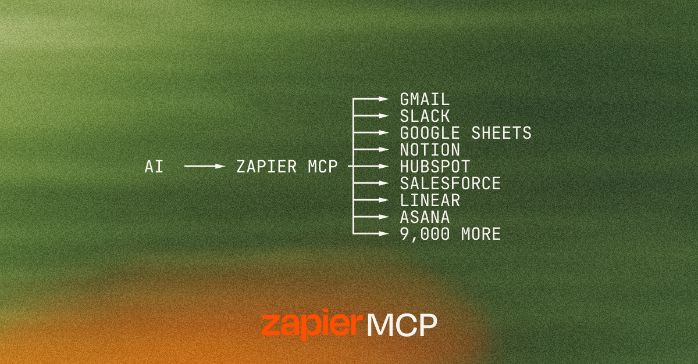

# Zapier MCP Plugin Distribution

The official home of the [Zapier MCP](https://docs.zapier.com/mcp/home) plugin — the safest way to give an agent access to your apps. ⚡

Zapier MCP is a hosted server that gives your AI governed, credential-safe access to 9,000+ apps. Send messages, pull data, trigger workflows. All in plain English.

This plugin is the part that lives in your AI client. Install it from your client's marketplace and your assistant arrives knowing how to use Zapier well, with guided onboarding, a quick demo, and skills tailored to your role.

**Get started with the plugin** → [docs.zapier.com/mcp/clients](https://docs.zapier.com/mcp/clients)

## What's in this repo

- **[`plugins/zapier/`](./plugins/zapier/)**: the plugin that onboards you to Zapier MCP and supercharges your experience

## Where to install this plugin

- **Claude Code**: add [`zapier/marketplace`](https://github.com/zapier/marketplace) or [`anthropics/claude-plugins-official`](https://github.com/anthropics/claude-plugins-official) manually
- **Cursor**: [cursor.com/marketplace/zapier](https://cursor.com/marketplace/zapier), via [`cursor/mcp-servers`](https://github.com/cursor/mcp-servers/tree/main/servers/zapier)
- **VS Code**: connects directly to the hosted MCP server — use the badge above, or add `https://mcp.zapier.com/api/v1/connect` (`type: http`) manually
- **OpenAI Codex**: via [`zapier/marketplace`](https://github.com/zapier/marketplace)
- **GitHub Copilot CLI**: via [`zapier/marketplace`](https://github.com/zapier/marketplace)
- **Claude Cowork**: via [`anthropics/knowledge-work-plugins`](https://github.com/anthropics/knowledge-work-plugins)
- **Kiro**: [kiro.dev/powers](https://kiro.dev/powers)
- **Gemini CLI**: `gemini extensions install https://github.com/zapier/zapier-mcp`, then `/mcp auth zapier` — see [`gemini-extension.json`](./gemini-extension.json)

## Third-party registries

Zapier MCP is also listed on:

- [Smithery](https://smithery.ai/servers/zapier)
- [PulseMCP](https://www.pulsemcp.com/servers/zapier)

## For contributors

- [AGENTS.md](./AGENTS.md): guide for AI agents working in this repo
- [CONTRIBUTING.md](./CONTRIBUTING.md): how to contribute
- [`llms.txt`](./llms.txt): LLM discovery index
